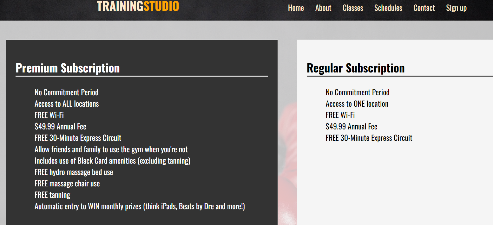
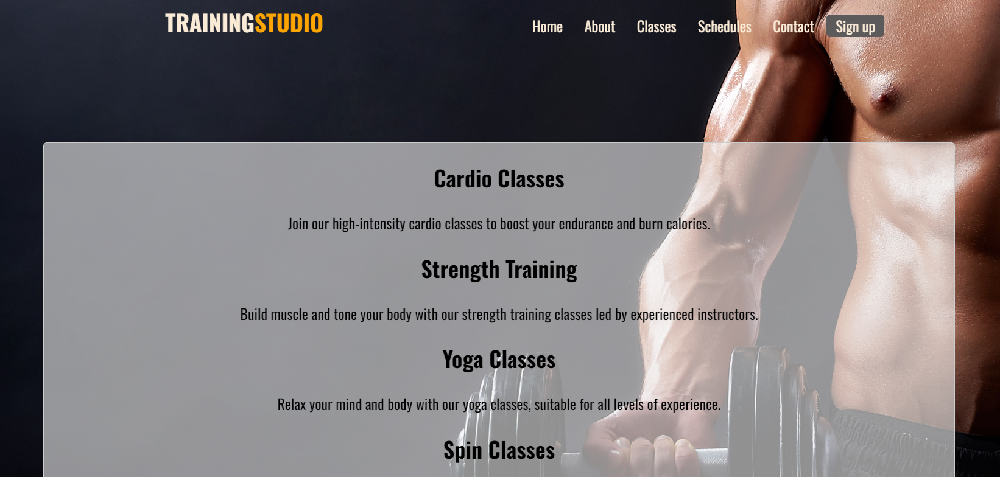
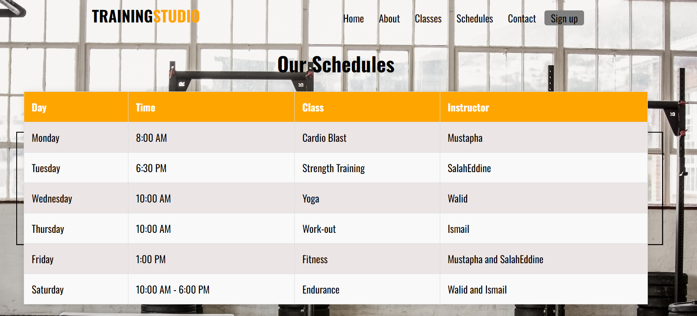
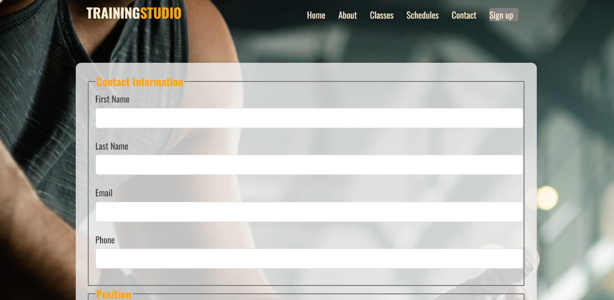

# Projet_UA2_Web
# Training Studio Gym

Bienvenue sur le site web du Training Studio Gym.
ce site a été réalisé par les Etudiants de Mr Diarra,inscrits dans le programme de Programmation informatique au collége la cité,Ottawa .

 Projet realisé par :
1/ Chef de projet : Mustapha toubal seghir
2/ collaborateurs : Salaheddine Ziani / Walid Naim / Ismail hussain ali

## Structure du Projet

Ce projet est structuré de manière à rendre la navigation et le développement plus organisés. Voici une brève description des principaux fichiers et dossiers

- `index.html` : Page d'accueil du site.
- `contact.html`: Page Contact avec un formulaire.
- `Schedules.html`: Page des Horraires et classes de gym.
- `Signup.html`: page d'inscription sur notre site.
- `membership.html`: page complementaire de la page sign-up.
- `Classes.html` : les differents programmes offert par notre salle de gym.
- `About us.html`: Connaitre l'histoire de notre salle de gym et sa creation.

- `style.css` : Feuille de style CSS principale de la page home.
- `contact.css`: feuille de style css pour la page contact.
- `Schedules.css`: feuille de style css pour la page schedules.
- `Signup.css`: feuille de style css pour la page sign-up.
- `membership.css`: feuille de style css pour la page membership.
- `Classes.css` : feuille de style css pour la page classes.
- `About us.css`: feuille de style css pour la page about us.
- `career.css`: feuille de style css pour la page career.

- `images/` : Dossier contenant les images du site.
- `style/` : Dossier contenant toutes les images du background ainsi que les css des differentes pages.

## Copies d'Écran

Des captures d'écran des différentes pages du site sont fournies pour donner un aperçu visuel de l'apparence du site.

## Commentaires generaux

